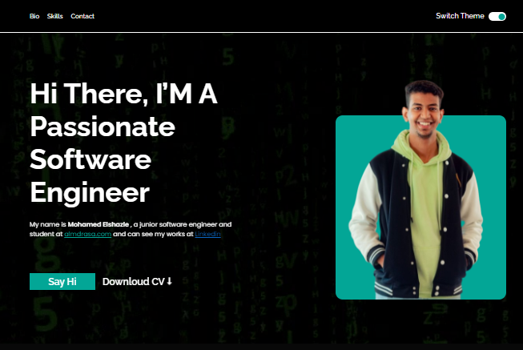

# Personal Website


## Overview

Welcome to my personal website! This project showcases my skills and experiences through a responsive and visually appealing web design. It was built using HTML, CSS, CSS Grid, Flexbox, and SASS.

### Live Demo

(https://mo-elshazle.github.io/Personal_website/)
## Technologies Used

- HTML
- CSS
- CSS Grid
- Flexbox
- SASS

## Features

- Responsive design
- Portfolio showcasing projects and experiences
- Contact form for inquiries

## Getting Started

1. Clone the repository:
   
   ``` git clone https://github.com/Mo-Elshazle/Personal-website.git```
2.  Navigate to the project directory:
   
    ``` cd Personal_website```
3.  Open the index.html file in your preferred web browser or set up a local development server.

## Contributing
Contributions are welcome! If you find any issues or have improvements to suggest, feel free to create a pull request.

## contact
For inquiries or feedback, please contact [m7md.elshazle@gmail.com].

